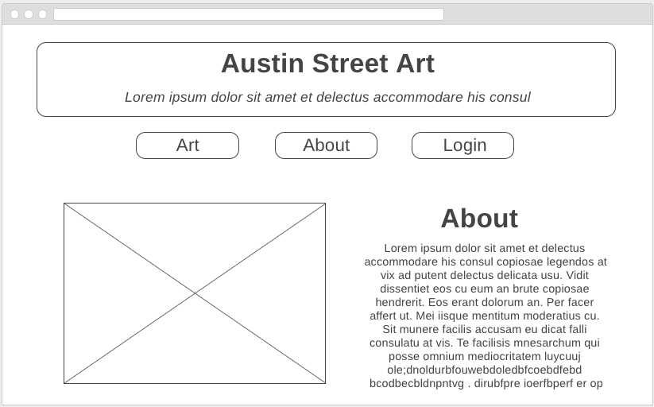
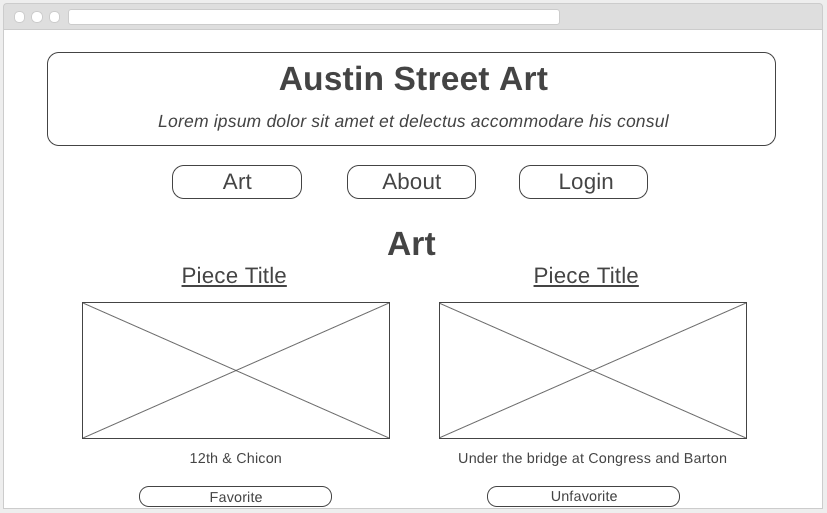

# Austin Street Art

Web application used to browse the street art of Austin, each piece of art has a title, picture, and address.

## Downloading Instructions

To run it locally,
1. Clone this repository
1. `npm install`
1. `npm start`
1. Direct the browser to `localhost:3000/`

## Technologies
- [Node.js](http://nodejs.org) - A server side JavaScript tool and the accompanying package manager
- [Express.js](https://github.com/expressjs/express) - A back-end web framework for [Node.js](http://nodejs.org)
- jQuery - A JavaScript library that allows for cleaner, less verbose code
- EJS - Embedded JavaScript allows JS to be incorporated in HTML codes
- OAuth - Enables authorization of user login by 3rd party sources
- MongoDB/Mongoose - NoSQL database used to create and store data

## Minimum Viable Product

The Minimum Viable Product version of the Austin Art web app is a much simplified version of what the final app will be. What follows is the specs for the minimal viable product. A central Kanban board tracking development is located here on [Trello](https://trello.com/b/ei25yci7/austin-wall-art). For the most up to date developments, take a quick look inside.

### Entity Relationship Diagram

### Wireframes

#### Home/About Page

#### Login Page

#### Art Page

#### User Profile Page

#### Editing User Profile Page

## Work In Progress

#### Map Page

## References
-  [Google API Services](https://console.developers.google.com/apis/dashboard?project=austin-art&duration=PT1H)
